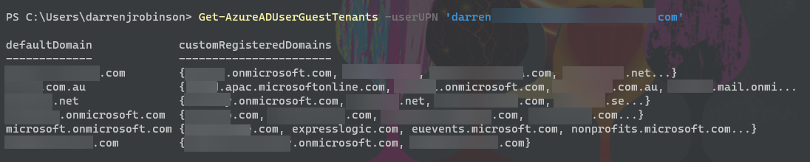

# Find which Azure Active Directory Tenants a Member User Account is Federated to as a B2B Guest User Account

[](https://www.powershellgallery.com/packages/AzureADUserFederation) [](https://www.powershellgallery.com/packages/AzureADUserFederation)

## Description

Signed PowerShell module to allow users lookup which Azure Active Directory Tenants they have an AAD B2B Guest User Account in.

The Azure Management API only supports delegated permissions, so must be run as the user being queried.

## Features

- Only requires an email/upn as input and verifies Azure AD Tenant for the domain name
- Returns a PSObject with the default domain name of any tenants the user member account is B2B Guest Federated too and any custom domain registrations for the foreign resource tenant
- Does not require a registered Azure AD Application. Leverages the Azure PowerShell Well-Known Client ID
- Interactive authentication using a browser and the local MSAL cache
- Works with Windows PowerShell and PowerShell (6.x+)

## Dependencies

- Utilises the [MSAL.PS](https://www.powershellgallery.com/packages/MSAL.PS) and [AzureADTenantID](https://www.powershellgallery.com/packages/AzureADTenantID) PowerShell modules which it will attempt to install if they aren't present.

## Installation

Install from the PowerShell Gallery on Windows PowerShell 5.1+ or PowerShell Core 6.x or PowerShell.

```powershell
Install-Module -name AzureADUserFederation
```

## How to use

```powershell
Import-Module AzureADUserFederation
Get-AzureADUserGuestTenants -userUPN 'user@aaddomain.com'
```

or

```powershell
Import-Module AzureADUserFederation
'user@aaddomain.com' | Get-AzureADUserGuestTenants
```

Force Authentication and bypass attempts to use MSAL Cache for AuthN

```powershell
Import-Module AzureADUserFederation
Get-AzureADUserGuestTenants -userUPN 'user@aaddomain.com' -forceAuth $true 
```

## Example Output



## Keep up to date

* [Visit my blog](https://blog.darrenjrobinson.com)
*  [Follow darrenjrobinson](https://twitter.com/darrenjrobinson)
